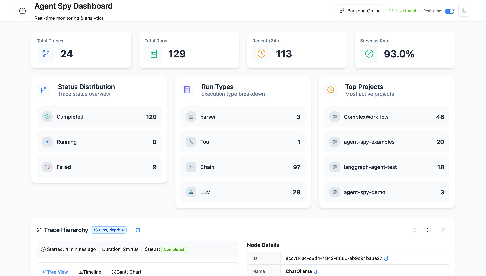

# Agent Spy Application Screenshots

This document contains screenshots of the Agent Spy application with brief descriptions of each view.

## Dashboard View

**Description**: Main dashboard interface showing the primary overview and navigation of the Agent Spy application.

## Details View

**Description**: Detailed view showing specific information and data breakdowns for selected items or agents.

## Preview Mode

**Description**: Preview interface displaying how data or content appears before final processing or display.

## Traces View

**Description**: Trace monitoring interface showing execution paths, logs, or debugging information for agent activities.

## Dark Mode Interface

**Description**: Dark theme version of the application interface with inverted color scheme for better visibility in low-light conditions.

---

_Note: These screenshots were captured from the Agent Spy application version 0.1.0 and represent the current state of the user interface._
