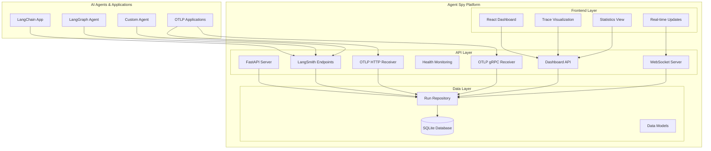
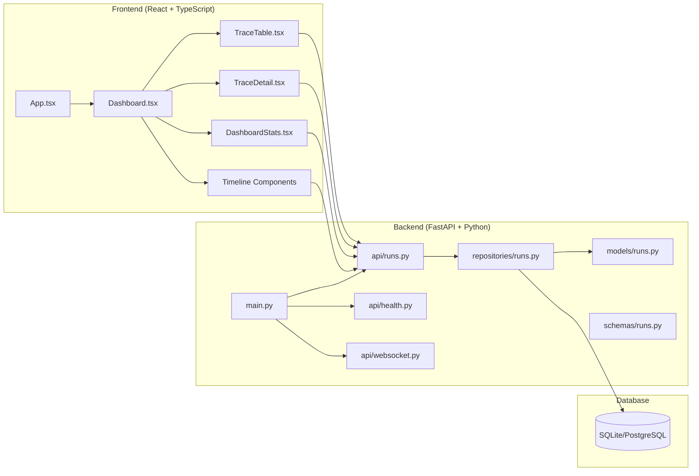
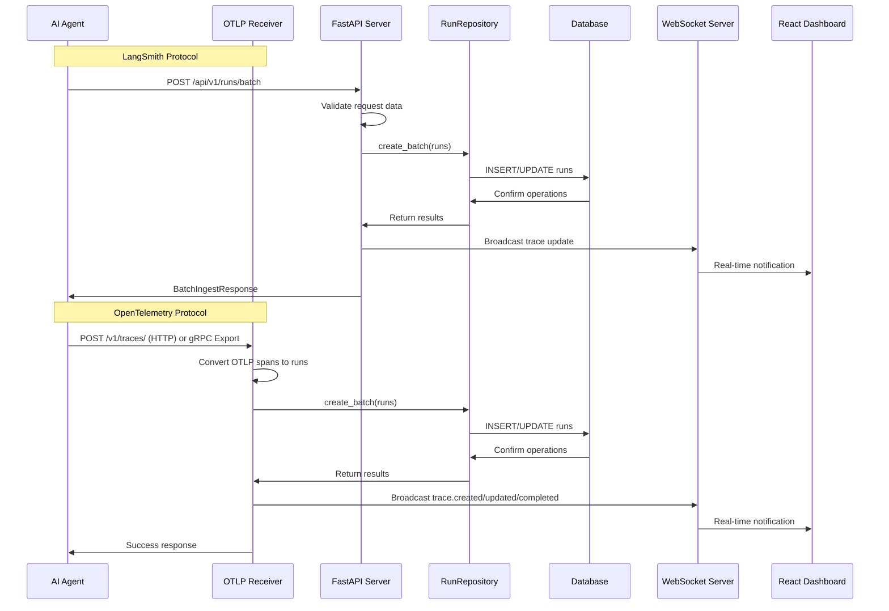
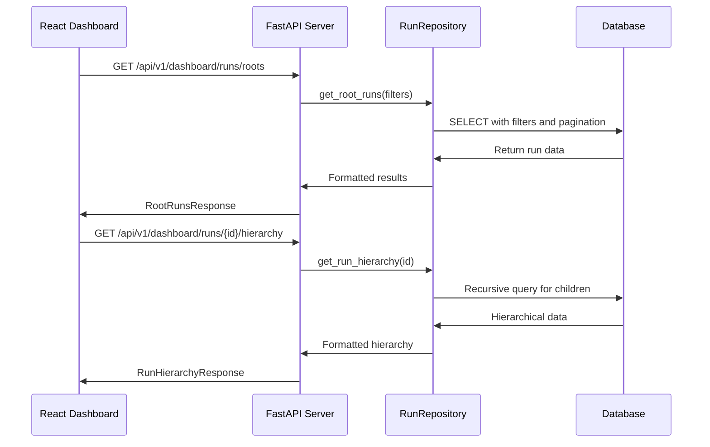
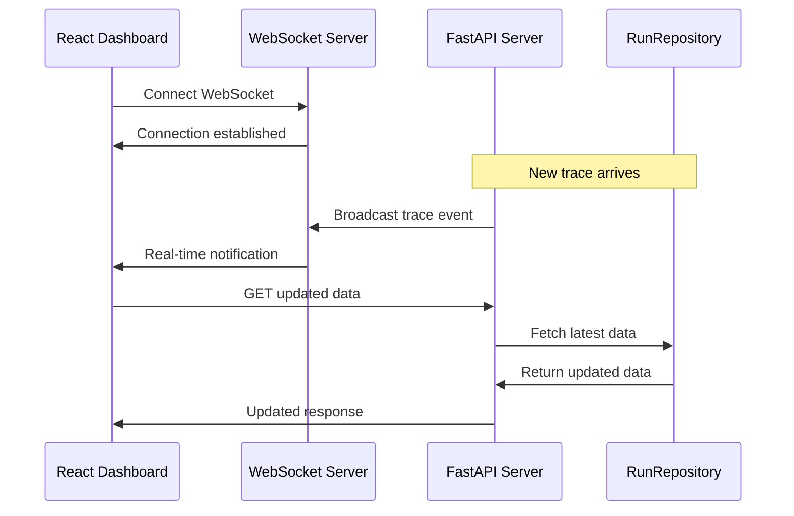
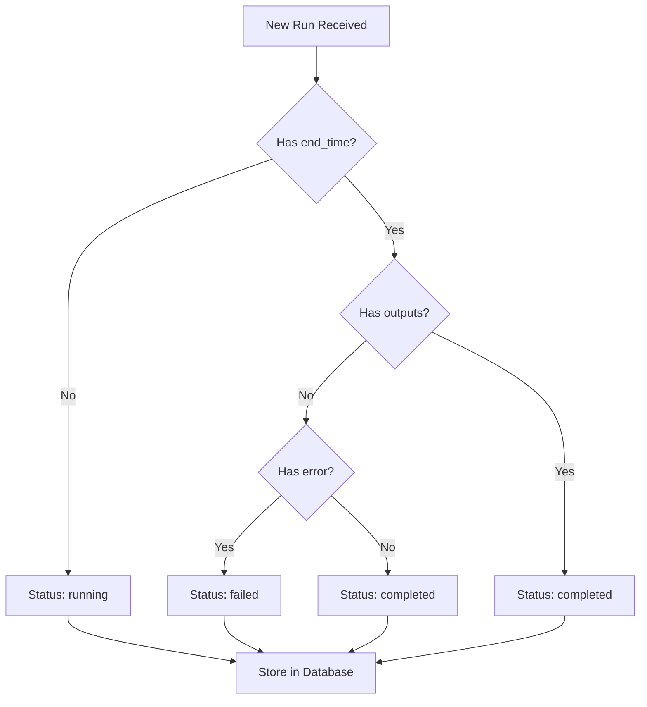
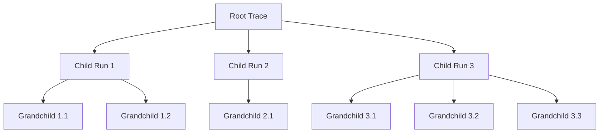
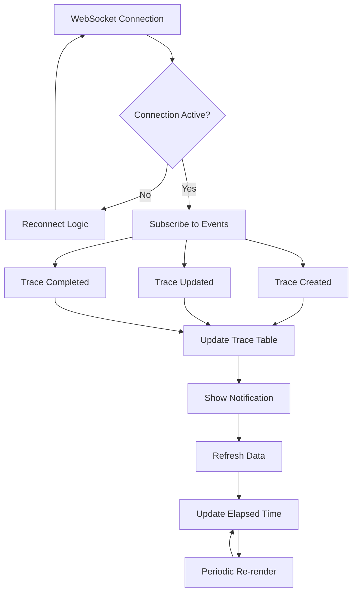
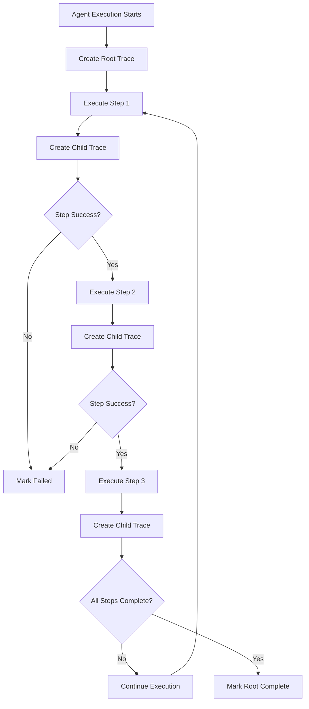

# Agent Spy - Comprehensive Guide for AI Assistants

## 📋 Document Purpose

This document serves as a comprehensive quick-start guide for developers and contributors working on the Agent Spy project. It provides up-to-date information about the codebase structure, architecture, features, and development patterns.

**⚠️ IMPORTANT: Keep this document updated whenever modifications and enhancements are made to the project.**

## 🏗️ Project Overview

Agent Spy is a powerful, self-hosted observability platform for AI agents and multi-step workflows. It provides comprehensive tracing, monitoring, and debugging capabilities with **LangSmith-compatible API** for seamless integration.

### Key Features

- **Real-time Agent Tracing**: Track agent executions with live WebSocket updates
- **Interactive Dashboard**: Clean, intuitive web interface for trace exploration
- **LangSmith Compatibility**: Drop-in replacement for LangSmith tracing
- **OpenTelemetry Protocol (OTLP) Support**: Native OTLP HTTP and gRPC receivers for industry-standard tracing
- **Smart Completion Detection**: Universal pattern-based detection for accurate run status
- **Production Ready**: High-performance, scalable architecture with Docker support
- **Advanced Theming**: Comprehensive theme system with dark/light mode support
- **Real-time Notifications**: Live updates and status notifications
- **Live Elapsed Time Updates**: Real-time duration tracking for running traces
- **Incremental Trace Sending**: Support for sending running and completed trace states

## 📁 Current Folder/File Structure

```
agent-spy/
├── .cursor/                     # Cursor IDE configuration
│   ├── artifacts/              # Temporary test files
│   └── rules/                  # AI coding rules
├── .devcontainer/              # VS Code Dev Container setup
├── .vscode/                    # VS Code settings
├── .github/                    # GitHub workflows and templates
├── backend/                    # Backend-specific files (legacy)
├── benchmark_results/          # Performance benchmark results
├── docker/                     # Docker configurations
│   ├── backend/               # Backend Dockerfile
│   ├── frontend/              # Frontend Dockerfile
│   ├── docker-compose.yml     # Production Docker Compose
│   ├── docker-compose.dev.yml # Development Docker Compose
│   └── init-postgresql.sql    # PostgreSQL initialization
├── docs/                       # Documentation
│   ├── plans/                 # Development plans (gitignored)
│   ├── AGENT_SPY_COMPREHENSIVE_GUIDE.md # This document
│   ├── API_REFERENCE.md       # API documentation
│   ├── ARCHITECTURE.md        # System architecture
│   ├── BACKEND_API.md         # Backend-specific docs
│   ├── DEVCONTAINER_SETUP.md  # Dev container setup
│   ├── DEVELOPMENT_GUIDE.md   # Development guide
│   ├── DOCKER_SETUP.md        # Docker deployment
│   ├── EXAMPLES_GUIDE.md      # Usage examples
│   ├── FRONTEND_DASHBOARD.md  # Frontend documentation
│   ├── OLLAMA_SETUP.md        # Ollama integration
│   ├── PORT_CONFIGURATION_IMPLEMENTATION_SUMMARY.md
│   ├── PROJECT_OVERVIEW.md    # Project overview
│   └── TROUBLESHOOTING.md     # Troubleshooting guide
├── examples/                   # Usage examples
│   ├── README.md              # Examples documentation
│   ├── nested_workflow_otlp_grpc.py      # OTLP gRPC nested workflow example
│   ├── nested_workflow_otlp_grpc_real.py # Real OTLP gRPC workflow example
│   ├── test_complex_langgraph_workflow.py
│   ├── test_dual_chain_agent.py
│   ├── test_langchain_app.py
│   ├── test_langgraph_agent.py
│   └── test_simple_tracing.py
├── frontend/                   # React frontend application
│   ├── src/
│   │   ├── components/        # React components
│   │   │   ├── ui/           # Reusable UI components
│   │   │   │   ├── Card.tsx
│   │   │   │   ├── StatCard.tsx
│   │   │   │   └── StatusCard.tsx
│   │   │   ├── ConnectionStatus.tsx
│   │   │   ├── Dashboard.tsx
│   │   │   ├── DashboardStats.tsx
│   │   │   ├── RealTimeNotifications.tsx
│   │   │   ├── SimpleTimeline.tsx
│   │   │   ├── ThemeToggle.tsx
│   │   │   ├── TraceDetail.tsx
│   │   │   ├── TraceTable.tsx
│   │   │   └── TraceTimeline.tsx
│   │   ├── contexts/         # React contexts
│   │   │   └── ThemeContext.tsx
│   │   ├── hooks/            # Custom React hooks
│   │   │   ├── useThemeStyles.ts
│   │   │   ├── useTraces.ts
│   │   │   └── useWebSocket.ts
│   │   ├── api/              # API client
│   │   │   └── client.ts
│   │   ├── types/            # TypeScript definitions
│   │   │   └── traces.ts
│   │   ├── utils/            # Utility functions
│   │   │   └── formatters.ts
│   │   ├── config/           # Configuration
│   │   │   ├── environment.ts
│   │   │   └── __tests__/
│   │   ├── theme/            # Theme system
│   │   │   ├── styled.ts
│   │   │   ├── tailwind-theme.ts
│   │   │   ├── tokens.ts
│   │   │   ├── utils.ts
│   │   │   └── variants.ts
│   │   ├── styles/           # Global styles
│   │   │   └── theme.css
│   │   └── assets/           # Static assets
│   │       └── react.svg
│   ├── public/               # Public assets
│   ├── package.json          # Dependencies
│   ├── package-lock.json     # Lock file
│   ├── vite.config.ts        # Vite configuration
│   ├── tailwind.config.js    # Tailwind CSS config
│   ├── postcss.config.js     # PostCSS configuration
│   ├── tsconfig.json         # TypeScript config
│   ├── tsconfig.app.json     # App-specific TS config
│   ├── tsconfig.node.json    # Node-specific TS config
│   ├── eslint.config.js      # ESLint configuration
│   ├── nginx.conf            # Nginx configuration
│   ├── Dockerfile            # Frontend Dockerfile
│   ├── .dockerignore         # Docker ignore file
│   ├── .gitignore            # Git ignore file
│   ├── env.template          # Environment template
│   ├── generate-theme.js     # Theme generation script
│   ├── theme-tokens.json     # Theme tokens
│   ├── index.html            # HTML entry point
│   └── README.md             # Frontend README
├── img/                       # Images and diagrams
├── redis_test_results/        # Redis benchmark results
├── scripts/                   # Utility scripts
├── src/                       # Backend source code
│   ├── api/                  # FastAPI route handlers
│   │   ├── health.py         # Health check endpoints
│   │   ├── runs.py           # Trace/run management
│   │   └── websocket.py      # WebSocket endpoints
│   ├── core/                 # Core infrastructure
│   │   ├── config.py         # Configuration management
│   │   ├── database.py       # Database connection
│   │   └── logging.py        # Logging configuration
│   ├── db/                   # Database utilities
│   ├── models/               # SQLAlchemy models
│   │   ├── base.py           # Base model classes
│   │   ├── feedback.py       # Feedback model
│   │   └── runs.py           # Run/trace model
│   ├── otel/                 # OpenTelemetry integration
│   │   ├── receiver/         # OTLP receivers
│   │   │   ├── http_server.py # OTLP HTTP receiver
│   │   │   ├── grpc_server.py # OTLP gRPC receiver
│   │   │   └── converter.py   # OTLP span converter
│   │   └── utils/            # OTLP utilities
│   │       └── mapping.py    # OTLP mapping utilities
│   ├── repositories/         # Data access layer
│   │   ├── feedback.py       # Feedback repository
│   │   └── runs.py           # Run repository
│   ├── schemas/              # Pydantic schemas
│   │   ├── dashboard.py      # Dashboard schemas
│   │   ├── feedback.py       # Feedback schemas
│   │   └── runs.py           # Run schemas
│   ├── services/             # Business logic layer
│   │   └── event_service.py  # Event handling service
│   ├── main.py               # Application entry point
│   └── __init__.py
├── tests/                     # Test suite
│   ├── unit/                 # Unit tests
│   ├── integration/          # Integration tests
│   ├── e2e/                  # End-to-end tests
│   ├── conftest.py           # Pytest configuration
│   ├── test_health.py        # Health endpoint tests
│   └── test_langchain_integration.py
├── .coverage                  # Test coverage data
├── .dockerignore             # Docker ignore file
├── .env                      # Environment variables (gitignored)
├── .gitignore                # Git ignore rules
├── .pre-commit-config.yaml   # Pre-commit hooks
├── .python-version           # Python version specification
├── .ruff_cache/              # Ruff cache directory
├── .pytest_cache/            # Pytest cache directory
├── agentspy.db               # SQLite database file
├── backend_test.log          # Backend test logs
├── env.example               # Environment template
├── LICENSE                   # MIT License
├── pyproject.toml            # Python project configuration
├── pytest.ini               # Pytest configuration
├── README.md                 # Main project README
├── redis_benchmark_results_20250817_074434.json
├── ruff.toml                 # Ruff linting configuration
├── server.log                # Server logs
├── uv.lock                   # UV dependency lock file
└── .venv/                    # Virtual environment (gitignored)
```

## 🏛️ Architecture Overview

### High-Level System Architecture



### Component Architecture



## 🔄 Data Flow Architecture

### Trace Ingestion Flow



### Dashboard Query Flow



### Real-time Updates Flow



## 🎯 Core Features & Logic

### 1. Smart Completion Detection



### 2. Trace Hierarchy Management



### 3. Real-time Dashboard Updates



### 4. Multi-step Workflow Processing



## 🔧 Technology Stack

### Backend Stack

- **Python 3.13+** with modern async/await patterns
- **FastAPI** for high-performance API development
- **SQLAlchemy 2.0** with async support for database operations
- **Pydantic** for data validation and serialization
- **uv** for fast dependency management
- **WebSockets** for real-time communication
- **aiosqlite** for async SQLite operations
- **asyncpg** for async PostgreSQL operations
- **psycopg2-binary** for PostgreSQL connectivity

### Frontend Stack

- **React 19** with TypeScript for type safety
- **Vite** for fast development and optimized builds
- **Ant Design** for professional UI components
- **TanStack Query** for efficient data fetching
- **Tailwind CSS 4.1** for utility-first styling
- **vis-timeline** for advanced timeline visualization
- **Recharts** for data visualization
- **dayjs** for date manipulation
- **@uiw/react-json-view** for JSON display
- **Advanced theming system** with dark/light mode support

### Infrastructure Stack

- **Docker & Docker Compose** for containerization
- **SQLite** for development; **PostgreSQL** supported
- **Nginx** for serving frontend assets
- **Health checks** and monitoring built-in
- **ESLint** for code linting
- **TypeScript** for type safety

## 📊 Current Project Status

### ✅ Completed Features

- Core trace ingestion and storage
- REST API with LangSmith compatibility
- **OpenTelemetry Protocol (OTLP) support** with HTTP and gRPC receivers
- React dashboard with real-time updates
- Docker containerization
- Smart completion detection
- Coordinated dashboard refresh
- Health monitoring and logging
- Comprehensive examples and testing
- Advanced theme system with dark/light mode
- Real-time notifications and status updates
- **Live elapsed time updates** for running traces (2-second intervals)
- **Incremental trace sending** support for running and completed states
- Responsive UI components
- TypeScript type safety throughout frontend

### 📈 Current Metrics

- **Test Coverage**: 53% (47 tests passing, 2 skipped)
- **Code Quality**: All linting and type checks passing
- **API Endpoints**: 15+ endpoints implemented
- **Frontend Components**: 12+ React components (including UI components)
- **Backend Files**: 25 Python files (including OTLP integration)
- **Frontend Files**: 33 TypeScript/TSX files
- **Documentation**: 13+ comprehensive guides
- **Test Files**: 12 Python test files
- **OTLP Support**: HTTP and gRPC receivers with real-time updates

### 🚧 Known Issues (To Fix Later)

1. **Test Failures:**

   - `test_api_docs_accessible` fails because API docs are only available in development mode

2. **Configuration Issues:**
   - Environment variable priority handling may need review

### 📋 Planned Features

- Authentication and authorization

## 🚀 Development Patterns

### Backend Development Patterns

#### 1. Repository Pattern

```python
# Example: src/repositories/runs.py
class RunRepository:
    async def create_batch(self, runs: list[RunCreate]) -> list[Run]:
        # Implementation
        pass

    async def get_root_runs(self, filters: dict) -> list[Run]:
        # Implementation
        pass
```

#### 2. Pydantic Schema Validation

```python
# Example: src/schemas/runs.py
class RunCreate(BaseModel):
    id: str
    name: str
    run_type: str
    start_time: datetime
    # ... other fields
```

#### 3. FastAPI Route Structure

```python
# Example: src/api/runs.py
@router.post("/runs/batch")
async def create_batch_runs(request: BatchIngestRequest) -> BatchIngestResponse:
    # Implementation
    pass
```

### Frontend Development Patterns

#### 1. React Query Integration

```typescript
// Example: frontend/src/hooks/useTraces.ts
export const useRootTraces = (filters: TraceFilters) => {
  return useQuery({
    queryKey: ["traces", "roots", filters],
    queryFn: () => api.getRootTraces(filters),
  });
};
```

#### 2. Component Composition

```typescript
// Example: frontend/src/components/Dashboard.tsx
const Dashboard: React.FC = () => {
  return (
    <div className="dashboard">
      <TraceTable onTraceSelect={setSelectedTrace} />
      <TraceDetail traceId={selectedTrace} />
      <DashboardStats />
    </div>
  );
};
```

#### 3. WebSocket Integration

```typescript
// Example: frontend/src/hooks/useWebSocket.ts
export const useWebSocket = () => {
  const [socket, setSocket] = useState<WebSocket | null>(null);
  // Implementation
};
```

#### 4. Theme System Integration

```typescript
// Example: frontend/src/contexts/ThemeContext.tsx
export const ThemeProvider: React.FC<{ children: React.ReactNode }> = ({
  children,
}) => {
  const [theme, setTheme] = useState<"light" | "dark">("light");
  // Implementation
};
```

#### 5. Custom Hooks for Styling

```typescript
// Example: frontend/src/hooks/useThemeStyles.ts
export const useThemeStyles = () => {
  // Theme-aware styling logic
};
```

## 🔍 Key Code Locations

### Backend Entry Points

- **Main Application**: `src/main.py`
- **API Routes**: `src/api/runs.py`, `src/api/health.py`, `src/api/websocket.py`
- **OTLP Integration**: `src/otel/receiver/http_server.py`, `src/otel/receiver/grpc_server.py`
- **Database Models**: `src/models/runs.py`, `src/models/feedback.py`
- **Data Access**: `src/repositories/runs.py`, `src/repositories/feedback.py`
- **Configuration**: `src/core/config.py`

### Frontend Entry Points

- **Main Application**: `frontend/src/App.tsx`
- **Dashboard**: `frontend/src/components/Dashboard.tsx`
- **Trace Management**: `frontend/src/components/TraceTable.tsx`, `frontend/src/components/TraceDetail.tsx`
- **Real-time Updates**: `frontend/src/hooks/useTraces.ts`, `frontend/src/hooks/useWebSocket.ts`
- **Theme System**: `frontend/src/contexts/ThemeContext.tsx`, `frontend/src/theme/`
- **API Client**: `frontend/src/api/client.ts`
- **Types**: `frontend/src/types/traces.ts`
- **Configuration**: `frontend/src/config/environment.ts`

### Configuration Files

- **Python Project**: `pyproject.toml`
- **Environment**: `env.example`, `.env`
- **Docker**: `docker/docker-compose.yml`, `docker/docker-compose.dev.yml`
- **Frontend**: `frontend/package.json`, `frontend/vite.config.ts`

## 🧪 Testing Strategy

### Test Structure

```
tests/
├── unit/           # Unit tests for individual components
├── integration/    # Integration tests for API endpoints
├── e2e/           # End-to-end tests for full workflows
└── conftest.py    # Pytest configuration and fixtures
```

### Running Tests

```bash
# Run all tests
uv run pytest

# Run with coverage
uv run pytest --cov=src --cov-report=html

# Run specific test categories
uv run pytest tests/unit/
uv run pytest tests/integration/
uv run pytest tests/e2e/
```

### Current Test Status

- **Total Tests**: 41 passing, 4 failed
- **Coverage**: 51% (1425 lines covered, 692 lines missing)
- **Test Files**: 12 Python files
- **Known Issues**: API docs accessibility and PostgreSQL configuration tests

## 📚 Documentation Structure

### Core Documentation

- **README.md**: Main project overview and quick start
- **AGENT_SPY_COMPREHENSIVE_GUIDE.md**: This document (for AI assistants)
- **PROJECT_OVERVIEW.md**: Detailed project overview
- **ARCHITECTURE.md**: System architecture documentation

### API Documentation

- **API_REFERENCE.md**: Comprehensive API documentation
- **BACKEND_API.md**: Backend-specific documentation
- **OTLP_INTEGRATION.md**: OpenTelemetry Protocol integration guide

### Development Documentation

- **DEVELOPMENT_GUIDE.md**: Developer setup and contribution guidelines
- **DOCKER_SETUP.md**: Container deployment guide
- **DEVCONTAINER_SETUP.md**: Dev container setup

### User Documentation

- **FRONTEND_DASHBOARD.md**: Frontend component documentation
- **EXAMPLES_GUIDE.md**: Usage examples and tutorials
- **TROUBLESHOOTING.md**: Common issues and solutions

## 🔄 Maintenance Instructions

### Keeping This Document Updated

**⚠️ CRITICAL: This document must be updated whenever the project is modified.**

#### When to Update:

1. **New Features Added**: Update feature descriptions and architecture diagrams
2. **Code Structure Changes**: Update folder/file structure section
3. **Technology Stack Changes**: Update technology stack section
4. **New Dependencies**: Update package configurations
5. **Architecture Changes**: Update mermaid diagrams
6. **New Components**: Update component descriptions
7. **API Changes**: Update API documentation references
8. **Test Coverage Changes**: Update metrics section

#### Update Checklist:

- [ ] Review and update folder structure
- [ ] Update architecture diagrams if needed
- [ ] Add new features to feature list
- [ ] Update technology stack if changed
- [ ] Update current project status
- [ ] Add new code patterns if introduced
- [ ] Update key code locations
- [ ] Review and update test strategy
- [ ] Update documentation structure
- [ ] Verify all links and references

#### How to Update:

1. **Folder Structure**: Use `tree` command or manual inspection
2. **Architecture Diagrams**: Update mermaid diagrams in this document
3. **Features**: Add to appropriate sections
4. **Metrics**: Run tests and update coverage numbers
5. **Code Patterns**: Document new patterns used

### Regular Maintenance Tasks

- **Monthly**: Review and update project status
- **Quarterly**: Update architecture diagrams
- **On Release**: Update version numbers and changelog
- **On Major Changes**: Complete document review

## 🎯 Quick Reference for AI Assistants

### Common Tasks

1. **Adding New API Endpoints**: See `src/api/runs.py` for patterns
2. **Creating New Models**: See `src/models/runs.py` for structure
3. **Adding Frontend Components**: See `frontend/src/components/` for patterns
4. **OTLP Integration**: See `src/otel/receiver/` for OTLP patterns
5. **Real-time Updates**: See `frontend/src/hooks/useTraces.ts` for patterns
6. **Database Changes**: Update models and run migrations
7. **Configuration Changes**: Modify `src/core/config.py`

### Important Files

- **Main Entry**: `src/main.py`
- **Configuration**: `src/core/config.py`
- **Database Models**: `src/models/`
- **API Routes**: `src/api/`
- **OTLP Integration**: `src/otel/receiver/`
- **Frontend App**: `frontend/src/App.tsx`
- **Real-time Hooks**: `frontend/src/hooks/useTraces.ts`
- **Package Config**: `pyproject.toml`, `frontend/package.json`

### Development Commands

```bash
# Backend
uv sync                    # Install dependencies
uv run python src/main.py  # Start backend
uv run pytest             # Run tests

# Frontend
cd frontend
npm install               # Install dependencies
npm run dev              # Start development server
npm run build            # Build for production
npm run lint             # Run linting

# Docker
docker compose -f docker/docker-compose.dev.yml up -d
```

### Testing Commands

```bash
# Run all tests
uv run pytest

# Run with coverage
uv run pytest --cov=src --cov-report=html

# Run specific tests
uv run pytest tests/unit/
uv run pytest tests/integration/
```

---

**Last Updated**: August 19, 2025
**Version**: 0.1.0
**Maintainer**: Development Team

**Remember**: Keep this document updated with every significant change to the project!
