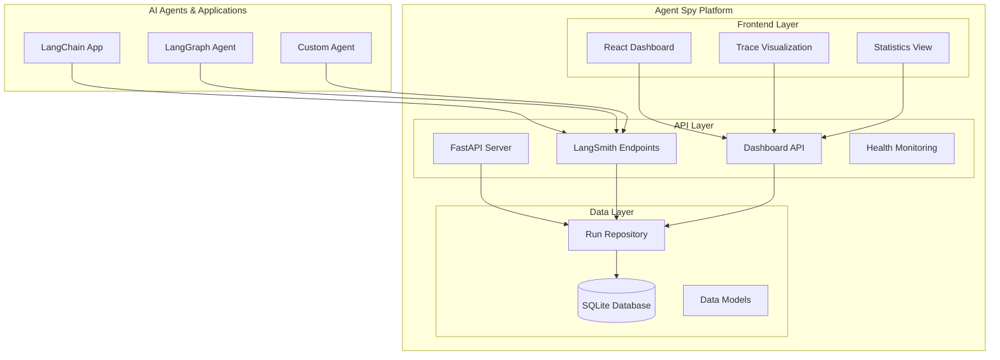
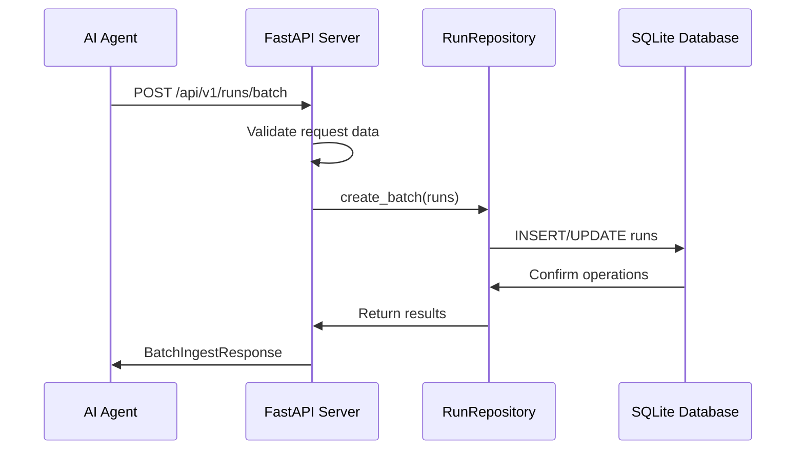
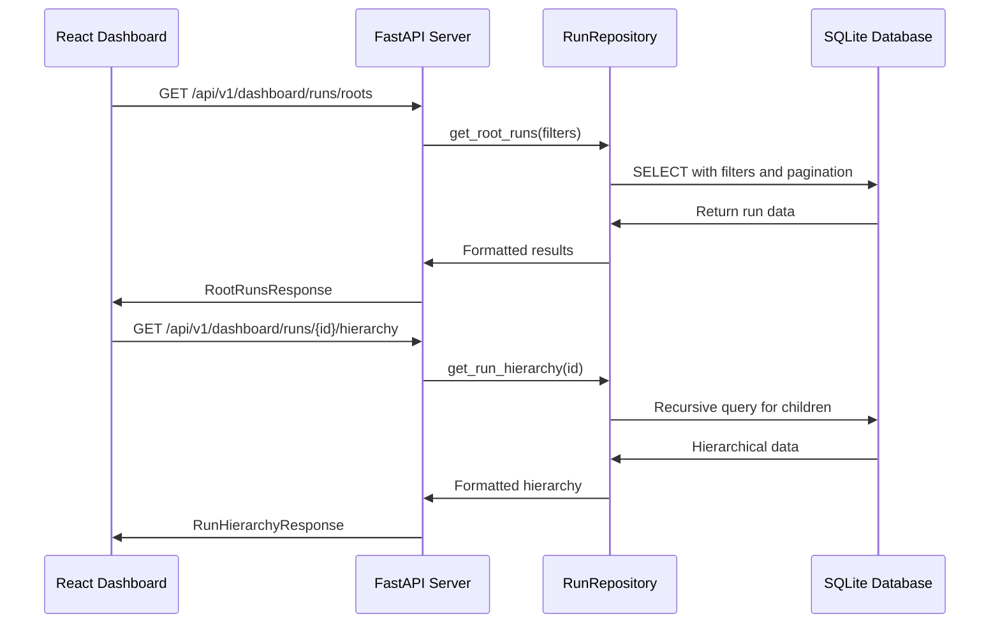

# Agent Spy - Architecture Documentation

## System Architecture

Agent Spy follows a modern, microservices-inspired architecture with clear separation of concerns between the frontend dashboard, backend API, and data storage layers.

## High-Level Architecture



## Component Breakdown

### 1. Frontend Layer (`frontend/`)

#### React Dashboard Application
- **Framework**: React 19 with TypeScript
- **Build Tool**: Vite for fast development and optimized builds
- **UI Library**: Ant Design for professional components
- **State Management**: React Query for server state management
- **Styling**: Tailwind CSS for utility-first styling

#### Key Components

```
frontend/src/
├── components/
│   ├── Dashboard.tsx          # Main dashboard container
│   ├── TraceTable.tsx         # Root traces table with filtering
│   ├── TraceDetail.tsx        # Detailed trace hierarchy view
│   ├── DashboardStats.tsx     # Statistics and metrics
│   ├── SimpleTimeline.tsx     # Timeline visualization
│   └── TraceTimeline.tsx      # Advanced timeline component
├── hooks/
│   └── useTraces.ts          # Custom hooks for data fetching
├── types/
│   └── traces.ts             # TypeScript type definitions
├── api/
│   └── client.ts             # API client configuration
└── utils/
    └── formatters.ts         # Data formatting utilities
```

#### Data Flow
1. **Dashboard** serves as the main container
2. **TraceTable** displays root traces with filtering/searching
3. **TraceDetail** shows hierarchical trace structure when selected
4. **DashboardStats** provides real-time statistics
5. **React Query** manages caching and synchronization

### 2. Backend API Layer (`src/`)

#### FastAPI Application
- **Framework**: FastAPI with async/await support
- **Database**: SQLAlchemy 2.0 with async support
- **Validation**: Pydantic for request/response validation
- **Configuration**: Pydantic Settings for environment management

#### Directory Structure

```
src/
├── main.py                   # Application entry point
├── api/
│   ├── health.py            # Health check endpoints
│   └── runs.py              # Trace ingestion and query endpoints
├── core/
│   ├── config.py            # Configuration management
│   ├── database.py          # Database connection and session management
│   └── logging.py           # Logging configuration
├── models/
│   ├── base.py              # Base SQLAlchemy models
│   ├── runs.py              # Run/trace database models
│   └── feedback.py          # Feedback database models
├── repositories/
│   ├── runs.py              # Run data access layer
│   └── feedback.py          # Feedback data access layer
├── schemas/
│   ├── runs.py              # Pydantic schemas for runs
│   ├── dashboard.py         # Dashboard-specific schemas
│   └── feedback.py          # Feedback schemas
└── services/                # Business logic layer (planned)
```

#### API Endpoints

##### LangSmith Compatible Endpoints
- `GET /api/v1/info` - Service information
- `POST /api/v1/runs/batch` - Batch trace ingestion
- `POST /api/v1/runs` - Create individual run
- `PATCH /api/v1/runs/{id}` - Update existing run
- `GET /api/v1/runs/{id}` - Get run details

##### Dashboard API Endpoints
- `GET /api/v1/dashboard/runs/roots` - Get root traces with filtering
- `GET /api/v1/dashboard/runs/{id}/hierarchy` - Get trace hierarchy
- `GET /api/v1/dashboard/stats/summary` - Get dashboard statistics

##### Health & Monitoring
- `GET /health` - Basic health check
- `GET /health/ready` - Readiness probe
- `GET /health/live` - Liveness probe

### 3. Data Layer

#### Database Schema

```sql
-- Main runs table stores all traces and spans
CREATE TABLE runs (
    id UUID PRIMARY KEY,
    name VARCHAR(500) NOT NULL,
    run_type VARCHAR(50) NOT NULL,
    start_time TIMESTAMP WITH TIME ZONE NOT NULL,
    end_time TIMESTAMP WITH TIME ZONE,
    parent_run_id UUID REFERENCES runs(id),
    inputs JSON,
    outputs JSON,
    extra JSON,
    serialized JSON,
    events JSON,
    error TEXT,
    tags JSON,
    reference_example_id UUID,
    status VARCHAR(20) DEFAULT 'running',
    project_name VARCHAR(255),
    created_at TIMESTAMP WITH TIME ZONE DEFAULT NOW(),
    updated_at TIMESTAMP WITH TIME ZONE DEFAULT NOW()
);

-- Indexes for performance
CREATE INDEX idx_runs_parent_start ON runs(parent_run_id, start_time);
CREATE INDEX idx_runs_project_time ON runs(project_name, start_time);
CREATE INDEX idx_runs_type_time ON runs(run_type, start_time);
CREATE INDEX idx_runs_status_time ON runs(status, start_time);
```

#### Data Models

##### SQLAlchemy Models (`src/models/`)
- **Run**: Core model for traces and spans
- **Base**: Shared functionality and mixins
- **TimestampMixin**: Automatic timestamp management
- **ProjectMixin**: Project-related fields

##### Pydantic Schemas (`src/schemas/`)
- **RunCreate**: Input validation for new runs
- **RunUpdate**: Input validation for run updates
- **RunResponse**: Output formatting for API responses
- **BatchIngestRequest**: Batch operation handling
- **DashboardStats**: Statistics aggregation

#### Repository Pattern
- **RunRepository**: Encapsulates all run-related database operations
- **FeedbackRepository**: Handles feedback and evaluation data
- Provides clean separation between API layer and database

## Data Flow Architecture

### 1. Trace Ingestion Flow



### 2. Dashboard Query Flow



## Configuration Management

### Environment-Based Configuration
Agent Spy uses Pydantic Settings for comprehensive configuration management:

```python
class Settings(BaseSettings):
    # Application Settings
    app_name: str = "Agent Spy"
    environment: str = "development"
    debug: bool = False
    
    # Server Settings  
    host: str = "0.0.0.0"
    port: int = 8000
    
    # Database Settings
    database_url: str = "sqlite+aiosqlite:///./agentspy.db"
    database_echo: bool = False
    
    # API Settings
    api_prefix: str = "/api/v1"
    require_auth: bool = False
    
    # CORS Settings
    cors_origins: list[str] = ["*"]
    cors_credentials: bool = True
```

### Docker Configuration
- **Production**: Optimized for performance and security
- **Development**: Hot reloading and debugging enabled
- **Environment Variables**: Comprehensive .env support

## Performance Considerations

### Database Optimization
- **Composite Indexes**: Optimized for common query patterns
- **Connection Pooling**: Efficient database connection management
- **Async Operations**: Non-blocking database operations

### API Performance
- **Async FastAPI**: High-concurrency request handling
- **Pydantic Validation**: Fast serialization/deserialization
- **Response Caching**: Planned for dashboard endpoints

### Frontend Optimization
- **React Query**: Intelligent caching and background updates
- **Code Splitting**: Optimized bundle sizes
- **Lazy Loading**: Components loaded on demand

## Security Architecture

### API Security
- **CORS Configuration**: Configurable cross-origin policies
- **Input Validation**: Comprehensive request validation
- **Error Handling**: Secure error responses
- **Request ID Tracking**: Request tracing for debugging

### Authentication (Planned)
- **API Key Authentication**: Simple key-based auth
- **Role-Based Access Control**: Project-level permissions
- **JWT Tokens**: Stateless authentication

### Data Protection
- **SQL Injection Prevention**: Parameterized queries
- **Input Sanitization**: XSS protection
- **Container Security**: Non-root user execution

## Monitoring & Observability

### Health Checks
- **Basic Health**: Application status
- **Readiness**: Database connectivity
- **Liveness**: Application responsiveness

### Logging
- **Structured Logging**: JSON format for production
- **Log Levels**: Configurable verbosity
- **Request Tracing**: Unique request IDs

### Metrics (Planned)
- **Prometheus Integration**: Standard metrics export
- **Custom Metrics**: Agent-specific measurements
- **Grafana Dashboards**: Visualization templates

## Scalability Considerations

### Horizontal Scaling
- **Stateless Design**: API servers can be load balanced
- **Database Separation**: External database support planned
- **Container Orchestration**: Kubernetes compatibility

### Vertical Scaling
- **Connection Pooling**: Efficient resource utilization
- **Async Processing**: High concurrency support
- **Memory Management**: Optimized data structures

### Storage Scaling
- **PostgreSQL Support**: Planned for production deployments
- **Data Partitioning**: Time-based partitioning strategy
- **Archive Strategy**: Long-term data management

## Development Architecture

### Code Organization
- **Clean Architecture**: Clear separation of concerns
- **Repository Pattern**: Abstracted data access
- **Dependency Injection**: Testable components
- **Type Safety**: Comprehensive TypeScript/Python typing

### Testing Strategy
- **Unit Tests**: Component-level testing
- **Integration Tests**: API endpoint testing
- **End-to-End Tests**: Full system testing
- **Performance Tests**: Load and stress testing

### Development Workflow
- **Hot Reloading**: Fast development iteration
- **Docker Development**: Consistent environments
- **Code Quality**: Linting, formatting, type checking
- **Documentation**: Comprehensive code documentation
