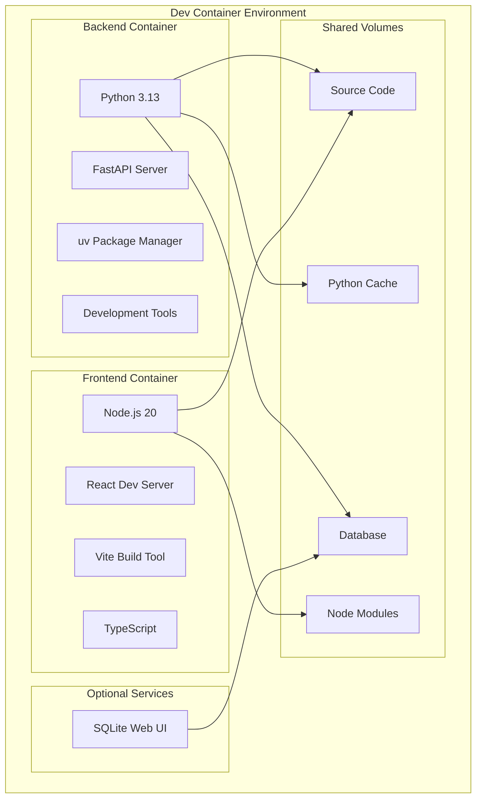

# Agent Spy - Dev Containers Setup Guide

## Overview

Agent Spy provides a comprehensive development container setup that enables a consistent, reproducible development environment across different machines and platforms. The dev container includes all necessary tools, dependencies, and configurations for both backend (Python/FastAPI) and frontend (TypeScript/React) development.

## Prerequisites

Before using the dev container, ensure you have the following installed:

- **Docker Desktop** (version 4.0+) or **Docker Engine** with **Docker Compose**
- **Visual Studio Code** with the **Dev Containers extension**
- **Git** for cloning the repository

### Installing Prerequisites

#### Docker Desktop
- **Windows/macOS**: Download from [docker.com](https://www.docker.com/products/docker-desktop/)
- **Linux**: Install Docker Engine and Docker Compose following the [official documentation](https://docs.docker.com/engine/install/)

#### VS Code Dev Containers Extension
1. Open VS Code
2. Go to Extensions (Ctrl+Shift+X)
3. Search for "Dev Containers" by Microsoft
4. Click Install

## Quick Start

### 1. Clone the Repository
```bash
git clone https://github.com/lalanikarim/agent-spy.git
cd agent-spy
```

### 2. Open in Dev Container
1. Open the project folder in VS Code
2. VS Code should automatically detect the dev container configuration
3. Click "Reopen in Container" when prompted, or:
   - Press `Ctrl+Shift+P` (or `Cmd+Shift+P` on macOS)
   - Type "Dev Containers: Reopen in Container"
   - Select the command

### 3. Wait for Container Setup
The first time you open the dev container, it will:
- Build the Docker images (this may take 5-10 minutes)
- Install all Python and Node.js dependencies
- Set up the development database
- Configure development tools and extensions

### 4. Start Development
Once the container is ready, you can start developing immediately:

```bash
# Start the backend server
agentspy-backend

# In a new terminal, start the frontend
agentspy-frontend

# Run tests
agentspy-test
```

## Dev Container Architecture

### Container Services

The dev container setup includes multiple services:



### Key Features

#### 🐍 **Backend Development**
- **Python 3.13** with async support
- **uv** for fast dependency management
- **FastAPI** with hot reloading
- **SQLite** database with web interface
- **Ruff** for linting and formatting
- **MyPy** for type checking
- **Pytest** for testing

#### 🌐 **Frontend Development**
- **Node.js 20** with npm
- **React 19** with TypeScript
- **Vite** dev server with hot reloading
- **Ant Design** UI components
- **Tailwind CSS** for styling
- **ESLint** and **Prettier** for code quality

#### 🔧 **Development Tools**
- **Git** configuration and hooks
- **VS Code** extensions pre-installed
- **Debugging** configurations
- **Task runners** for common operations
- **Database management** tools

## File Structure

```
.devcontainer/
├── devcontainer.json          # Main dev container configuration
├── docker-compose.dev.yml     # Docker Compose for dev services
├── backend.Dockerfile         # Backend container definition
├── frontend.Dockerfile        # Frontend container definition
├── development.env            # Environment variables
├── launch.json               # VS Code debug configurations
├── tasks.json                # VS Code task definitions
├── post-create.sh            # Setup script after container creation
└── post-start.sh             # Script run on container start
```

## Configuration Details

### Main Configuration (`devcontainer.json`)

The main configuration file defines:
- **Base Service**: Uses the backend container as the primary development environment
- **VS Code Extensions**: Pre-installs essential extensions for Python, TypeScript, Docker, and more
- **Port Forwarding**: Automatically forwards development server ports
- **Volume Mounts**: Mounts source code and caches for optimal performance

### Docker Compose (`docker-compose.dev.yml`)

Defines the multi-container development environment:
- **Backend Container**: Python development with all tools
- **Frontend Container**: Node.js development environment
- **SQLite Web**: Optional database management interface
- **Named Volumes**: For dependency caches and persistent data

### Environment Configuration

Development-specific environment variables are configured for:
- **Permissive CORS** settings for local development
- **Debug logging** enabled
- **Hot reloading** for both backend and frontend
- **Development database** location

## Development Workflow

### Starting Development

1. **Open in Dev Container** (one-time setup)
2. **Start Backend Server**:
   ```bash
   agentspy-backend
   # or using VS Code task: Ctrl+Shift+P -> "Tasks: Run Task" -> "Start Backend Server"
   ```

3. **Start Frontend Server** (in new terminal):
   ```bash
   agentspy-frontend
   # or using VS Code task: "Start Frontend Dev Server"
   ```

4. **Access Applications**:
   - Backend API: http://localhost:8000
   - API Documentation: http://localhost:8000/docs
   - Frontend: http://localhost:3000
   - SQLite Web (if enabled): http://localhost:8080

### Common Development Tasks

#### Code Quality
```bash
# Format code
agentspy-format

# Lint code
agentspy-lint

# Type checking
uv run mypy src/
```

#### Testing
```bash
# Run all tests
agentspy-test

# Run tests with coverage
uv run pytest --cov=src --cov-report=html

# Run specific test file
uv run pytest tests/test_specific.py -v
```

#### Database Management
```bash
# Open SQLite CLI
agentspy-db

# Reset development database
rm dev-data/agentspy_dev.db
```

#### Running Examples
```bash
# Run example scripts to test the system
uv run python examples/test_langchain_app.py
```

### VS Code Integration

The dev container comes pre-configured with:

#### Extensions
- **Python**: Full Python development support
- **Ruff**: Fast Python linting and formatting
- **TypeScript**: Advanced TypeScript support
- **ESLint/Prettier**: JavaScript/TypeScript code quality
- **Docker**: Container management
- **GitLens**: Enhanced Git integration
- **REST Client**: API testing
- **SQLTools**: Database management

#### Debug Configurations
- **Debug Backend**: Full FastAPI application debugging
- **Debug Tests**: Debug specific test files
- **Debug Examples**: Debug example scripts with LangSmith integration

#### Tasks
Pre-configured tasks for common operations:
- Start/stop servers
- Run tests and linting
- Build applications
- Database operations

## Advanced Usage

### Customizing the Environment

#### Adding Python Dependencies
```bash
# Add new dependency
uv add package-name

# Add development dependency
uv add --dev package-name
```

#### Adding Node.js Dependencies
```bash
cd frontend
npm install package-name
```

#### Modifying Container Configuration
Edit `.devcontainer/devcontainer.json` to:
- Add new VS Code extensions
- Change port forwarding
- Modify environment variables
- Add new features

### Multiple Development Environments

You can create environment-specific configurations:

```bash
# Copy the dev container configuration
cp -r .devcontainer .devcontainer-custom

# Modify the custom configuration
# Then use: "Dev Containers: Reopen in Container" and select the custom config
```

### Database Management

#### Using SQLite Web Interface
Enable the SQLite web interface by running with the `tools` profile:
```bash
docker compose -f .devcontainer/docker-compose.dev.yml --profile tools up -d
```

Access at http://localhost:8080

#### Database Backup and Restore
```bash
# Backup
sqlite3 dev-data/agentspy_dev.db .dump > backup.sql

# Restore
sqlite3 dev-data/agentspy_dev.db < backup.sql
```

## Troubleshooting

### Common Issues

#### 1. Container Won't Start
```bash
# Check Docker daemon
docker info

# Rebuild containers
docker compose -f .devcontainer/docker-compose.dev.yml build --no-cache

# Check logs
docker compose -f .devcontainer/docker-compose.dev.yml logs
```

#### 2. Port Already in Use
```bash
# Check what's using the port
lsof -i :8000

# Kill the process or change ports in docker-compose.dev.yml
```

#### 3. Permission Issues
```bash
# Fix file permissions
sudo chown -R $USER:$USER .

# Or rebuild with correct user ID
docker compose -f .devcontainer/docker-compose.dev.yml build --build-arg USER_UID=$(id -u) --build-arg USER_GID=$(id -g)
```

#### 4. Slow Performance
- **Windows**: Ensure WSL2 is enabled and project is in WSL filesystem
- **macOS**: Use Docker Desktop with VirtioFS enabled
- **All Platforms**: Ensure sufficient Docker resources (CPU/Memory)

#### 5. Extensions Not Loading
```bash
# Reload VS Code window
Ctrl+Shift+P -> "Developer: Reload Window"

# Or reinstall extensions
Ctrl+Shift+P -> "Dev Containers: Rebuild Container"
```

### Getting Help

#### Check Container Status
```bash
# View running containers
docker ps

# Check container logs
docker logs agentspy-dev-backend
docker logs agentspy-dev-frontend
```

#### Access Container Shell
```bash
# Backend container
docker exec -it agentspy-dev-backend bash

# Frontend container
docker exec -it agentspy-dev-frontend bash
```

#### Reset Everything
```bash
# Stop and remove containers
docker compose -f .devcontainer/docker-compose.dev.yml down -v

# Remove images
docker rmi $(docker images "agentspy*" -q)

# Reopen in container (will rebuild everything)
```

## Performance Optimization

### Volume Optimization
The dev container uses named volumes for:
- **Node modules**: Faster npm operations
- **Python cache**: Faster uv operations
- **Build cache**: Faster Docker builds

### Development vs Production
The dev container is optimized for development with:
- **Hot reloading** enabled
- **Debug symbols** included
- **Development tools** installed
- **Permissive security** settings

For production deployment, use the standard Docker setup in `/docker/`.

## Integration with CI/CD

The dev container configuration can be used in CI/CD pipelines:

```yaml
# GitHub Actions example
- name: Run tests in dev container
  uses: devcontainers/ci@v0.3
  with:
    imageName: ghcr.io/your-org/agent-spy-dev
    runCmd: uv run pytest
```

## Best Practices

### 1. Keep Containers Updated
Regularly rebuild containers to get security updates:
```bash
docker compose -f .devcontainer/docker-compose.dev.yml build --pull
```

### 2. Use Named Volumes
Named volumes provide better performance than bind mounts for:
- Node modules
- Python packages
- Build caches

### 3. Environment Separation
Use different database files for different environments:
- Development: `dev-data/agentspy_dev.db`
- Testing: In-memory SQLite
- Production: PostgreSQL (planned)

### 4. Resource Management
Monitor Docker resource usage:
```bash
docker stats
```

Adjust Docker Desktop resources as needed.

### 5. Security
- Don't commit sensitive data to the container
- Use environment variables for secrets
- Regularly update base images

## Contributing to Dev Container Setup

To improve the dev container configuration:

1. **Test Changes**: Always test changes locally
2. **Document Changes**: Update this documentation
3. **Version Compatibility**: Ensure compatibility with different Docker versions
4. **Cross-Platform**: Test on Windows, macOS, and Linux
5. **Performance**: Consider impact on startup time and resource usage

## Conclusion

The Agent Spy dev container provides a comprehensive, consistent development environment that enables developers to be productive immediately. With pre-configured tools, debugging support, and optimized performance, it eliminates the "works on my machine" problem and ensures all team members have the same development experience.

For additional help or questions about the dev container setup, please refer to the main project documentation or open an issue in the repository.
