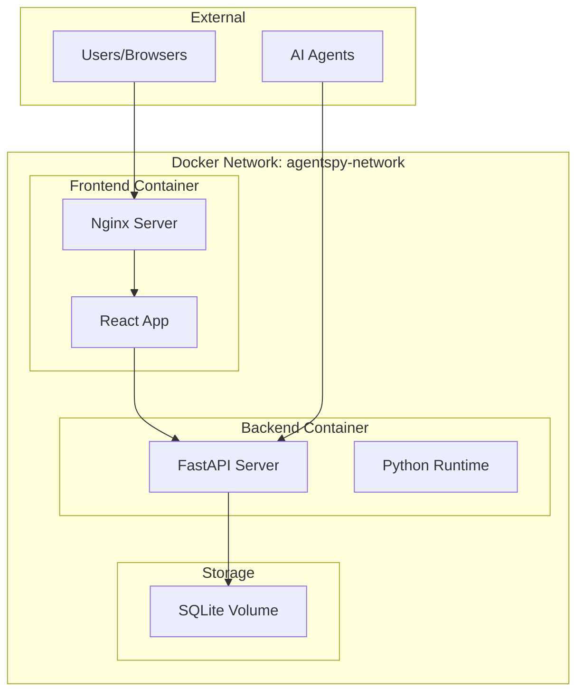

# Agent Spy - Docker Setup Guide

## Overview

Agent Spy provides comprehensive Docker support with separate configurations for production and development environments. The containerized setup includes the FastAPI backend, React frontend, and persistent SQLite storage.

## Quick Start

### Prerequisites
- [Docker](https://docker.com/) (version 20.10+)
- [Docker Compose](https://docs.docker.com/compose/) (version 2.0+)
- Git (for cloning the repository)

### 1. Clone Repository
```bash
git clone https://github.com/lalanikarim/agent-spy.git
cd agent-spy
```

### 2. Configure Environment
```bash
# Copy the environment template
cp env.example .env

# Edit the .env file with your preferred settings
nano .env  # or your preferred editor
```

### 3. Start Agent Spy

#### Production Deployment
```bash
# Using the convenience script
bash scripts/docker-start.sh

# Or manually with docker compose
docker compose -f docker/docker-compose.yml up -d
```

#### Development Environment
```bash
# Using the convenience script
bash scripts/docker-dev.sh

# Or manually with docker compose
docker compose -f docker/docker-compose.dev.yml up -d
```

## Docker Architecture

### Service Overview



### Container Details

#### Frontend Container (`agentspy-frontend`)
- **Base Image**: `nginx:alpine`
- **Build Process**: Multi-stage build with Node.js 20
- **Served Content**: Optimized React production build
- **Port**: 80 (configurable via `FRONTEND_PORT`)
- **Health Check**: HTTP request to root path

#### Backend Container (`agentspy-backend`)
- **Base Image**: `python:3.13-slim`
- **Package Manager**: uv for fast dependency management
- **Runtime**: FastAPI with Uvicorn server
- **Port**: 8000 (configurable via `BACKEND_PORT`)
- **Health Check**: HTTP request to `/health` endpoint

## Configuration Files

### Production Configuration (`docker-compose.yml`)

```yaml
version: '3.8'

services:
  backend:
    build:
      context: ..
      dockerfile: docker/backend/Dockerfile
    container_name: agentspy-backend
    restart: unless-stopped
    environment:
      ENVIRONMENT: production
      DEBUG: false
      HOST: 0.0.0.0
      PORT: 8000
      DATABASE_URL: sqlite+aiosqlite:////app/data/agentspy.db
      CORS_ORIGINS: "*"
    ports:
      - "${BACKEND_PORT:-8000}:8000"
    volumes:
      - sqlite_data:/app/data
    healthcheck:
      test: ["CMD", "curl", "-f", "http://localhost:8000/health"]
      interval: 30s
      timeout: 10s
      retries: 3
      start_period: 40s

  frontend:
    build:
      context: ../frontend
      dockerfile: ../docker/frontend/Dockerfile
    container_name: agentspy-frontend
    restart: unless-stopped
    ports:
      - "${FRONTEND_PORT:-80}:80"
    depends_on:
      - backend
    environment:
      - VITE_API_BASE_URL=http://localhost:${BACKEND_PORT:-8000}

volumes:
  sqlite_data:
    driver: local

networks:
  agentspy-network:
    driver: bridge
```

### Development Configuration (`docker-compose.dev.yml`)

Key differences from production:
- **Hot Reloading**: Source code mounted as volumes
- **Debug Mode**: Enabled for both frontend and backend
- **Different Ports**: 8001 (backend), 3000 (frontend) to avoid conflicts
- **Verbose Logging**: DEBUG level logging enabled
- **Development Database**: Separate SQLite file (`agentspy_dev.db`)

## Environment Variables

### Core Settings
```bash
# Environment type
ENVIRONMENT=production  # or development

# Debug mode
DEBUG=false  # Set to true for development

# Service ports
BACKEND_PORT=8000   # Backend API port
FRONTEND_PORT=80    # Frontend web interface port
```

### Database Configuration
```bash
# Database settings
DATABASE_ECHO=false  # Set to true to see SQL queries

# Note: Database URL is automatically configured for Docker
# SQLite file is stored in persistent volume at /app/data/
```

### API Configuration
```bash
# Authentication (optional)
REQUIRE_AUTH=false
API_KEYS=your-api-key-1,your-api-key-2

# CORS settings
CORS_ORIGINS=http://localhost:3000,https://yourdomain.com
CORS_CREDENTIALS=true
```

### Performance Settings
```bash
# Resource limits
MAX_TRACE_SIZE_MB=10
REQUEST_TIMEOUT=30

# Logging
LOG_LEVEL=INFO
LOG_FORMAT=json
```

## Docker Commands Reference

### Basic Operations
```bash
# Start services
docker compose -f docker/docker-compose.yml up -d

# Stop services
docker compose -f docker/docker-compose.yml down

# View logs
docker compose -f docker/docker-compose.yml logs -f

# View service status
docker compose -f docker/docker-compose.yml ps
```

### Development Commands
```bash
# Start development environment
docker compose -f docker/docker-compose.dev.yml up -d

# Follow backend logs
docker compose -f docker/docker-compose.dev.yml logs -f backend

# Follow frontend logs
docker compose -f docker/docker-compose.dev.yml logs -f frontend

# Restart a specific service
docker compose -f docker/docker-compose.dev.yml restart backend
```

### Maintenance Commands
```bash
# Rebuild containers (after code changes)
docker compose -f docker/docker-compose.yml up -d --build

# Clean up containers and networks
docker compose -f docker/docker-compose.yml down --remove-orphans

# Remove volumes (WARNING: This deletes all data)
docker compose -f docker/docker-compose.yml down -v

# View container resource usage
docker stats agentspy-backend agentspy-frontend
```

## Dockerfile Analysis

### Backend Dockerfile (`docker/backend/Dockerfile`)

```dockerfile
FROM python:3.13-slim

# Environment setup
ENV PYTHONUNBUFFERED=1 \
    PYTHONDONTWRITEBYTECODE=1 \
    UV_SYSTEM_PYTHON=1 \
    PYTHONPATH=/app

# Install system dependencies
RUN apt-get update && apt-get install -y curl && rm -rf /var/lib/apt/lists/*

# Install uv package manager
COPY --from=ghcr.io/astral-sh/uv:latest /uv /bin/uv

# Copy and install Python dependencies
COPY pyproject.toml uv.lock ./
RUN uv sync --frozen --no-dev

# Copy source code
COPY src/ ./src/

# Security: Create non-root user
RUN adduser --disabled-password --gecos '' appuser && \
    mkdir -p /app/data && \
    chown -R appuser:appuser /app
USER appuser

# Health check and startup
HEALTHCHECK --interval=30s --timeout=10s --start-period=5s --retries=3 \
    CMD curl -f http://localhost:8000/health || exit 1
CMD ["uv", "run", "python", "src/main.py"]
```

**Key Features:**
- **Multi-stage optimization**: Efficient layer caching
- **Security**: Non-root user execution
- **Fast dependencies**: uv package manager
- **Health monitoring**: Built-in health checks
- **Clean environment**: Minimal attack surface

### Frontend Dockerfile (`docker/frontend/Dockerfile`)

```dockerfile
# Build stage
FROM node:20-alpine as builder
WORKDIR /app
COPY package*.json ./
RUN npm ci
COPY . .
RUN npm run build

# Production stage
FROM nginx:alpine
COPY --from=builder /app/dist /usr/share/nginx/html
COPY nginx.conf /etc/nginx/conf.d/default.conf
HEALTHCHECK --interval=30s --timeout=10s --start-period=5s --retries=3 \
    CMD wget --no-verbose --tries=1 --spider http://localhost:80/ || exit 1
CMD ["nginx", "-g", "daemon off;"]
```

**Key Features:**
- **Multi-stage build**: Separates build and runtime environments
- **Optimized size**: Alpine-based images
- **Static serving**: Nginx for efficient asset delivery
- **Custom configuration**: Optimized nginx.conf

## Networking

### Docker Network Configuration
- **Network Name**: `agentspy-network` (production) / `agentspy-dev-network` (development)
- **Driver**: Bridge network for container communication
- **Port Mapping**: Host ports mapped to container ports
- **Service Discovery**: Containers can communicate by service name

### Port Mapping
```
Host Port → Container Port
FRONTEND_PORT (80) → 80    # Frontend web interface
BACKEND_PORT (8000) → 8000 # Backend API server
```

### Internal Communication
```
frontend → backend:8000  # API requests
backend → sqlite_data    # Database access
```

## Data Persistence

### Volume Management
```bash
# Production volume
sqlite_data:/app/data  # Persistent SQLite database

# Development volume  
sqlite_dev_data:/app/data  # Separate development database
```

### Backup Strategy
```bash
# Create database backup
docker run --rm -v agentspy_sqlite_data:/data -v $(pwd):/backup alpine \
  tar czf /backup/agentspy-backup-$(date +%Y%m%d).tar.gz -C /data .

# Restore database backup
docker run --rm -v agentspy_sqlite_data:/data -v $(pwd):/backup alpine \
  tar xzf /backup/agentspy-backup-YYYYMMDD.tar.gz -C /data
```

## Health Monitoring

### Container Health Checks
Both containers include built-in health checks:

```bash
# Check container health
docker compose -f docker/docker-compose.yml ps

# View health check logs
docker inspect agentspy-backend --format='{{json .State.Health}}'
```

### Application Health Endpoints
```bash
# Basic health check
curl http://localhost:8000/health

# Readiness check (for load balancers)
curl http://localhost:8000/health/ready

# Liveness check (for orchestrators)
curl http://localhost:8000/health/live
```

## Troubleshooting

### Common Issues

#### 1. Port Conflicts
```bash
# Check if ports are in use
lsof -i :8000  # Backend port
lsof -i :80    # Frontend port

# Solution: Change ports in .env file
BACKEND_PORT=8001
FRONTEND_PORT=8080
```

#### 2. Permission Issues
```bash
# Fix volume permissions
sudo chown -R $USER:$USER ./data

# Or recreate volumes
docker compose down -v
docker compose up -d
```

#### 3. Build Failures
```bash
# Clear Docker cache
docker system prune -a

# Rebuild without cache
docker compose build --no-cache
```

#### 4. Database Issues
```bash
# Check database volume
docker volume inspect agentspy_sqlite_data

# Access database directly
docker exec -it agentspy-backend sqlite3 /app/data/agentspy.db
```

### Debugging Commands
```bash
# Access backend container shell
docker exec -it agentspy-backend bash

# Access frontend container shell  
docker exec -it agentspy-frontend sh

# View container logs with timestamps
docker compose logs -f -t backend

# Monitor container resources
docker stats --format "table {{.Container}}\t{{.CPUPerc}}\t{{.MemUsage}}"
```

## Production Deployment

### Recommended Production Setup
1. **Reverse Proxy**: Use Nginx or Traefik for SSL termination
2. **Domain Configuration**: Set up proper domain names
3. **SSL Certificates**: Use Let's Encrypt for HTTPS
4. **Monitoring**: Add Prometheus/Grafana monitoring
5. **Backup Strategy**: Automated database backups
6. **Log Management**: Centralized logging with ELK stack

### Security Considerations
- **API Keys**: Enable authentication with strong API keys
- **CORS**: Restrict origins to known domains
- **Firewall**: Limit access to necessary ports only
- **Updates**: Regular security updates for base images
- **Secrets**: Use Docker secrets for sensitive data

### Scaling Considerations
- **Load Balancing**: Multiple backend instances behind load balancer
- **Database**: Migrate to PostgreSQL for production scale
- **Caching**: Add Redis for session and response caching
- **CDN**: Use CDN for static asset delivery
