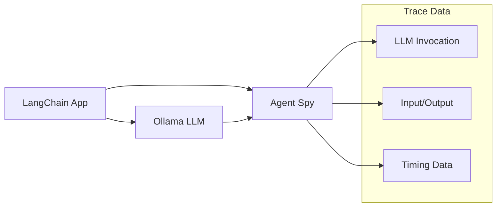
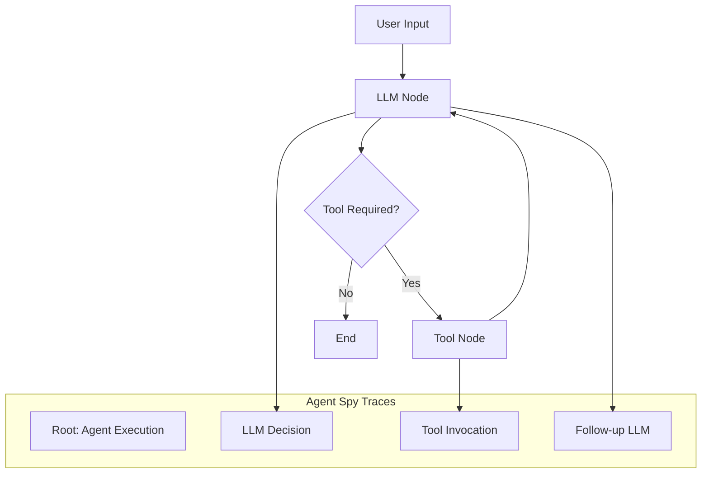
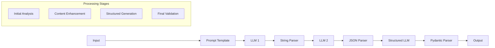
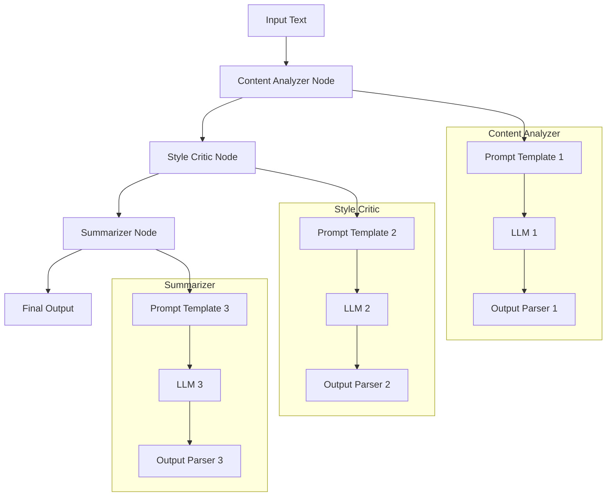

# Agent Spy - Examples Guide

## Overview

The Agent Spy examples demonstrate how to integrate various AI agent frameworks with Agent Spy for comprehensive observability. These examples showcase different patterns of agent execution, from simple LLM calls to complex multi-step workflows.

## Prerequisites

### System Requirements
- **Agent Spy Server**: Running on `http://localhost:8000`
- **Ollama Server**: Accessible at `aurora.local:11434` (configurable)
- **Python Environment**: Python 3.13+ with uv package manager
- **Required Model**: `qwen3:8b` (or other compatible models)

### Setup Instructions
1. **Start Agent Spy**:
   ```bash
   PYTHONPATH=. uv run python src/main.py
   ```

2. **Verify Ollama**:
   ```bash
   curl http://aurora.local:11434/api/tags
   ```

3. **Install Dependencies**:
   ```bash
   uv sync
   ```

## Example Applications

### 1. Basic LangChain Integration (`test_langchain_app.py`)

A foundational example demonstrating basic LangChain tracing integration.

#### Purpose
- Showcase simple LangChain configuration for Agent Spy
- Demonstrate basic LLM invocation tracing
- Verify end-to-end integration functionality

#### Architecture


#### Code Structure
```python
# Configuration
def setup_agent_spy_tracing():
    os.environ["LANGSMITH_TRACING"] = "true"
    os.environ["LANGSMITH_ENDPOINT"] = "http://localhost:8000/api/v1"
    os.environ["LANGSMITH_API_KEY"] = "test-api-key-123"
    os.environ["LANGSMITH_PROJECT"] = "agent-spy-demo"

# Basic LLM test
def run_basic_llm_test(model_name: str):
    llm = OllamaLLM(
        model=model_name,
        base_url="http://aurora.local:11434",
        temperature=0.1,
    )
    
    prompt = "What is artificial intelligence? Answer in one sentence."
    response = llm.invoke(prompt)  # This generates traces
    
# Chain test
def run_chain_test(model_name: str):
    llm = OllamaLLM(model=model_name, base_url="http://aurora.local:11434")
    prompt_template = PromptTemplate(
        input_variables=["topic", "style"],
        template="Write a {style} explanation of {topic} in one sentence."
    )
    
    chain = LLMChain(llm=llm, prompt=prompt_template)
    result = chain.invoke({"topic": "machine learning", "style": "simple"})
```

#### Expected Trace Structure
```
Root Trace: LLMChain Execution
├── Prompt Template Processing
├── LLM Invocation
│   ├── Input: {"topic": "machine learning", "style": "simple"}
│   ├── Output: "Machine learning is..."
│   └── Timing: ~2000ms
└── Chain Result Formatting
```

#### Usage
```bash
PYTHONPATH=. uv run python examples/test_langchain_app.py
```

### 2. LangGraph Agent (`test_langgraph_agent.py`)

A more sophisticated example using LangGraph for multi-node agent execution.

#### Purpose
- Demonstrate complex agent workflow tracing
- Showcase tool usage and conditional routing
- Illustrate parent-child trace relationships

#### Architecture


#### Code Structure
```python
# Tool definition
@tool
def get_current_time() -> str:
    """Get the current system time."""
    current_time = datetime.now()
    return f"The current time is {current_time.strftime('%Y-%m-%d %H:%M:%S %Z')}"

# Agent state
class AgentState(TypedDict):
    messages: Annotated[list, "The list of messages in the conversation"]

# LLM node
def llm_node(state: AgentState):
    llm = create_llm()
    response = llm.invoke(state["messages"])
    return {"messages": [response]}

# Routing logic
def should_continue(state: AgentState) -> Literal["tools", "end"]:
    messages = state["messages"]
    last_message = messages[-1]
    
    if hasattr(last_message, "tool_calls") and last_message.tool_calls:
        return "tools"
    return "end"

# Graph construction
def create_agent_graph():
    workflow = StateGraph(AgentState)
    
    workflow.add_node("llm", llm_node)
    workflow.add_node("tools", ToolNode([get_current_time]))
    
    workflow.add_edge(START, "llm")
    workflow.add_conditional_edges("llm", should_continue, {
        "tools": "tools",
        "end": END,
    })
    workflow.add_edge("tools", "llm")
    
    return workflow.compile()
```

#### Expected Trace Structure
```
Root Trace: LangGraph Agent Execution
├── Initial LLM Call
│   ├── Input: "What time is it now?"
│   ├── Output: [Tool Call Request]
│   └── Decision: Route to Tools
├── Tool Execution
│   ├── Tool: get_current_time
│   ├── Input: {}
│   ├── Output: "The current time is..."
│   └── Duration: ~50ms
└── Follow-up LLM Call
    ├── Input: [Tool Result]
    ├── Output: "The current time is 2024-01-15..."
    └── Decision: End
```

#### Usage
```bash
PYTHONPATH=. uv run python examples/test_langgraph_agent.py
```

### 3. Complex Multi-Step Workflow (`test_complex_langgraph_workflow.py`)

A sophisticated 7-step linear pipeline demonstrating deep trace hierarchies.

#### Purpose
- Showcase complex multi-step LLM processing
- Demonstrate structured output generation
- Illustrate deep trace hierarchy visualization
- Test dashboard performance with complex traces

#### Architecture


#### Code Structure
```python
# Pydantic model for structured output
class HistoricalAnalysis(BaseModel):
    person: str
    time_period: str
    key_achievements: list[str]
    historical_impact: str
    legacy_summary: str

# Workflow definition
def create_complex_workflow():
    workflow = StateGraph(WorkflowState)
    
    # Step 1: Initial prompt processing
    workflow.add_node("prompt_template", prompt_template_node)
    
    # Step 2: Initial LLM analysis
    workflow.add_node("llm_analysis", llm_analysis_node)
    
    # Step 3: String parsing and cleaning
    workflow.add_node("string_parser", string_parser_node)
    
    # Step 4: Content enhancement LLM
    workflow.add_node("llm_enhancement", llm_enhancement_node)
    
    # Step 5: JSON parsing and validation
    workflow.add_node("json_parser", json_parser_node)
    
    # Step 6: Structured output generation
    workflow.add_node("structured_llm", structured_llm_node)
    
    # Step 7: Final Pydantic parsing
    workflow.add_node("pydantic_parser", pydantic_parser_node)
    
    # Linear workflow edges
    workflow.add_edge(START, "prompt_template")
    workflow.add_edge("prompt_template", "llm_analysis")
    workflow.add_edge("llm_analysis", "string_parser")
    workflow.add_edge("string_parser", "llm_enhancement")
    workflow.add_edge("llm_enhancement", "json_parser")
    workflow.add_edge("json_parser", "structured_llm")
    workflow.add_edge("structured_llm", "pydantic_parser")
    workflow.add_edge("pydantic_parser", END)
    
    return workflow.compile()
```

#### Expected Trace Structure
```
Root Trace: Complex Historical Analysis Workflow
├── Step 1: Prompt Template Processing
│   ├── Input: {"person": "Leonardo da Vinci"}
│   ├── Template: "Analyze the historical significance of {person}..."
│   └── Output: Formatted prompt
├── Step 2: Initial LLM Analysis
│   ├── Input: Formatted prompt
│   ├── LLM Processing: ~3000ms
│   └── Output: Raw analysis text
├── Step 3: String Parser
│   ├── Input: Raw analysis text
│   ├── Cleaning: Remove formatting, normalize
│   └── Output: Clean text
├── Step 4: Content Enhancement LLM
│   ├── Input: Clean text
│   ├── Enhancement: Add structure and detail
│   └── Output: Enhanced content
├── Step 5: JSON Parser
│   ├── Input: Enhanced content
│   ├── Parsing: Extract structured data
│   └── Output: JSON object
├── Step 6: Structured LLM Generation
│   ├── Input: JSON object
│   ├── Structured Generation: Pydantic-compatible
│   └── Output: Structured response
└── Step 7: Pydantic Parser
    ├── Input: Structured response
    ├── Validation: Type checking and validation
    └── Output: HistoricalAnalysis object
```

#### Usage
```bash
PYTHONPATH=. uv run python examples/test_complex_langgraph_workflow.py
```

### 4. Dual Chain Agent (`test_dual_chain_agent.py`)

A LangGraph agent with specialized analysis nodes using separate LLM chains.

#### Purpose
- Demonstrate multiple independent LLM chains
- Showcase specialized analysis patterns
- Illustrate parallel processing capabilities
- Test complex trace visualization

#### Architecture


#### Code Structure
```python
# Specialized chain creation
def create_content_analyzer_chain():
    prompt = PromptTemplate(
        input_variables=["text"],
        template="""Analyze the following text for content quality:
        Text: {text}
        
        Provide analysis on:
        - Main themes and topics
        - Factual accuracy
        - Completeness of information
        - Clarity of communication"""
    )
    
    llm = ChatOllama(model="qwen3:8b", base_url="http://aurora.local:11434")
    parser = StrOutputParser()
    
    return prompt | llm | parser

def create_style_critic_chain():
    prompt = PromptTemplate(
        input_variables=["text", "content_analysis"],
        template="""Review the writing style of this text:
        Text: {text}
        
        Previous content analysis: {content_analysis}
        
        Evaluate:
        - Writing style and tone
        - Grammar and syntax
        - Readability and flow
        - Audience appropriateness"""
    )
    
    llm = ChatOllama(model="qwen3:8b", base_url="http://aurora.local:11434")
    parser = StrOutputParser()
    
    return prompt | llm | parser

# Agent nodes
def content_analyzer_node(state: AnalysisState):
    chain = create_content_analyzer_chain()
    analysis = chain.invoke({"text": state["text"]})
    return {"content_analysis": analysis}

def style_critic_node(state: AnalysisState):
    chain = create_style_critic_chain()
    critique = chain.invoke({
        "text": state["text"],
        "content_analysis": state["content_analysis"]
    })
    return {"style_critique": critique}

def summarizer_node(state: AnalysisState):
    chain = create_summarizer_chain()
    summary = chain.invoke({
        "content_analysis": state["content_analysis"],
        "style_critique": state["style_critique"]
    })
    return {"final_summary": summary}
```

#### Expected Trace Structure
```
Root Trace: Dual Chain Text Analysis
├── Content Analyzer Node
│   ├── Chain 1: Content Analysis
│   │   ├── Prompt Template Processing
│   │   ├── LLM Invocation (Content Focus)
│   │   └── String Output Parsing
│   └── Output: Content analysis report
├── Style Critic Node
│   ├── Chain 2: Style Analysis
│   │   ├── Prompt Template Processing
│   │   ├── LLM Invocation (Style Focus)
│   │   └── String Output Parsing
│   └── Output: Style critique report
└── Summarizer Node
    ├── Chain 3: Summary Generation
    │   ├── Prompt Template Processing
    │   ├── LLM Invocation (Summary Focus)
    │   └── String Output Parsing
    └── Output: Final comprehensive summary
```

#### Usage
```bash
PYTHONPATH=. uv run python examples/test_dual_chain_agent.py
```

## Configuration Details

### Environment Variables
All examples use consistent configuration:

```python
# LangSmith/Agent Spy Configuration
os.environ["LANGSMITH_TRACING"] = "true"
os.environ["LANGSMITH_ENDPOINT"] = "http://localhost:8000/api/v1"
os.environ["LANGSMITH_API_KEY"] = "test-key"
os.environ["LANGSMITH_PROJECT"] = "example-project-name"
```

### Ollama Configuration
```python
# Standard Ollama setup
llm = ChatOllama(
    model="qwen3:8b",                    # Model name
    base_url="http://aurora.local:11434", # Ollama server
    temperature=0.1,                     # Low temperature for consistency
)
```

### Model Requirements
- **Primary Model**: `qwen3:8b` (recommended)
- **Alternatives**: `qwen3:1.7b`, `llama3.2:1b`, `llama3.2`, `phi3`
- **Minimum Requirements**: 4GB RAM, supports function calling

## Trace Analysis Patterns

### 1. Simple Linear Traces
Basic LLM invocations create simple linear traces:
```
Root → LLM Call → Response
```

### 2. Chain-based Traces
LangChain chains create structured hierarchies:
```
Root → Chain
├── Prompt Processing
├── LLM Invocation
└── Output Formatting
```

### 3. Agent-based Traces
LangGraph agents create complex decision trees:
```
Root → Agent
├── Decision Node
├── Tool Execution (conditional)
├── Follow-up Processing
└── Final Response
```

### 4. Multi-step Workflows
Complex workflows create deep hierarchies:
```
Root → Workflow
├── Step 1 → Processing → Output
├── Step 2 → Processing → Output
├── ...
└── Step N → Processing → Output
```

## Debugging and Troubleshooting

### Common Issues

#### 1. Connection Problems
```bash
# Check Agent Spy health
curl http://localhost:8000/health

# Check Ollama availability
curl http://aurora.local:11434/api/tags
```

#### 2. Model Issues
```python
# List available models
def check_ollama_availability():
    response = requests.get("http://aurora.local:11434/api/tags")
    models = response.json().get("models", [])
    print("Available models:", [m["name"] for m in models])
```

#### 3. Tracing Configuration
```python
# Verify tracing environment
print("Tracing enabled:", os.environ.get("LANGSMITH_TRACING"))
print("Endpoint:", os.environ.get("LANGSMITH_ENDPOINT"))
print("Project:", os.environ.get("LANGSMITH_PROJECT"))
```

### Debugging Tips

1. **Check Logs**: Monitor Agent Spy server logs for trace ingestion
2. **Verify Timing**: Ensure traces have sufficient time to be sent
3. **Test Incrementally**: Start with simple examples before complex ones
4. **Monitor Resources**: Ensure sufficient memory for model execution

## Advanced Usage Patterns

### Custom Tool Integration
```python
@tool
def custom_analysis_tool(data: str) -> str:
    """Custom tool for specialized analysis."""
    # Custom processing logic
    return processed_result

# Tool usage in agent
tools = [custom_analysis_tool]
llm_with_tools = llm.bind_tools(tools)
```

### Error Handling in Workflows
```python
def error_handling_node(state: WorkflowState):
    try:
        # Process step
        result = process_step(state)
        return {"result": result, "error": None}
    except Exception as e:
        return {"result": None, "error": str(e)}
```

### Conditional Routing
```python
def smart_router(state: AgentState) -> str:
    """Route based on content analysis."""
    content = state["messages"][-1].content
    
    if "technical" in content.lower():
        return "technical_expert"
    elif "creative" in content.lower():
        return "creative_assistant"
    else:
        return "general_assistant"
```

## Performance Considerations

### Model Selection
- **Development**: Use smaller models (`qwen3:1.7b`, `llama3.2:1b`)
- **Production**: Use larger models for better quality
- **Resource Constraints**: Monitor memory usage with multiple concurrent calls

### Trace Optimization
- **Batch Processing**: Group related operations
- **Selective Tracing**: Disable tracing for non-critical operations
- **Timeout Configuration**: Set appropriate timeouts for long-running operations

### Dashboard Performance
- **Pagination**: Use appropriate page sizes for large datasets
- **Filtering**: Apply filters to reduce data volume
- **Refresh Intervals**: Balance real-time updates with performance

## Integration Examples

### Custom Framework Integration
```python
# Custom tracing integration
class CustomAgent:
    def __init__(self):
        self.tracer = LangSmithTracer()
    
    def execute(self, task):
        with self.tracer.trace("custom_agent", inputs={"task": task}):
            result = self.process_task(task)
            return result
```

### Batch Processing
```python
# Process multiple tasks with tracing
async def batch_process_tasks(tasks):
    results = []
    for i, task in enumerate(tasks):
        with trace_context(f"batch_task_{i}"):
            result = await process_single_task(task)
            results.append(result)
    return results
```

### Production Monitoring
```python
# Production tracing configuration
def setup_production_tracing():
    os.environ["LANGSMITH_TRACING"] = "true"
    os.environ["LANGSMITH_ENDPOINT"] = "https://agent-spy.company.com/api/v1"
    os.environ["LANGSMITH_API_KEY"] = get_secure_api_key()
    os.environ["LANGSMITH_PROJECT"] = f"production-{get_environment()}"
```

## Next Steps

After running the examples:

1. **Explore Dashboard**: View traces in the Agent Spy web interface
2. **Analyze Patterns**: Study different trace structures and hierarchies
3. **Custom Integration**: Adapt patterns for your specific use cases
4. **Performance Testing**: Test with larger datasets and complex workflows
5. **Production Deployment**: Configure for production monitoring

For more advanced usage, see the [API Documentation](BACKEND_API.md) and [Dashboard Guide](FRONTEND_DASHBOARD.md).
