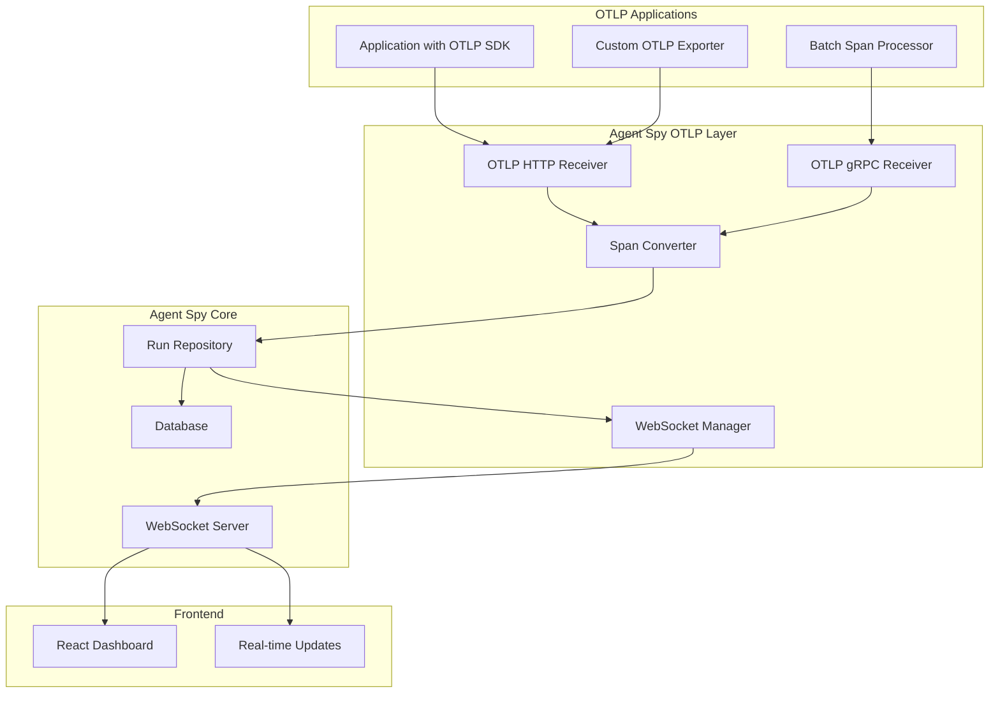

# OpenTelemetry Protocol (OTLP) Integration

## Overview

Agent Spy now supports the OpenTelemetry Protocol (OTLP) for industry-standard tracing integration. This enables seamless integration with any application that uses OpenTelemetry SDKs, providing real-time trace visualization and monitoring.

## Features

### ✅ Implemented Features

- **OTLP HTTP Receiver**: Accepts traces via HTTP POST to `/v1/traces/`
- **OTLP gRPC Receiver**: Accepts traces via gRPC Export service
- **Real-time Updates**: Live WebSocket notifications for trace events
- **Incremental Trace Sending**: Support for running and completed trace states
- **Live Elapsed Time**: Real-time duration tracking for running traces
- **Span Conversion**: Automatic conversion from OTLP spans to Agent Spy runs
- **Hierarchical Support**: Full parent-child relationship preservation
- **Status Mapping**: OTLP status codes mapped to Agent Spy status
- **Attribute Preservation**: All OTLP attributes preserved in trace metadata

## Architecture

### OTLP Integration Flow



## Implementation Details

### OTLP HTTP Receiver

**Endpoint**: `POST /v1/traces/`

**Features**:

- Accepts both protobuf and JSON formats
- Automatic content-type detection
- Batch span processing
- Real-time WebSocket broadcasting
- Incremental trace updates

**Example Request**:

```bash
curl -X POST http://localhost:8000/v1/traces/ \
  -H "Content-Type: application/x-protobuf" \
  --data-binary @traces.pb
```

### OTLP gRPC Receiver

**Service**: `opentelemetry.proto.collector.trace.v1.TraceService`

**Features**:

- Standard OTLP gRPC protocol
- Async processing
- Batch export support
- Real-time WebSocket broadcasting

**Example Client**:

```python
import grpc
from opentelemetry.proto.collector.trace.v1 import trace_service_pb2_grpc

channel = grpc.aio.insecure_channel('localhost:4317')
stub = trace_service_pb2_grpc.TraceServiceStub(channel)
response = await stub.Export(request)
```

### Span Conversion

The OTLP integration automatically converts OpenTelemetry spans to Agent Spy runs:

| OTLP Field             | Agent Spy Field         | Notes                              |
| ---------------------- | ----------------------- | ---------------------------------- |
| `span_id`              | `id`                    | UUID conversion                    |
| `trace_id`             | `trace_id`              | Preserved in metadata              |
| `name`                 | `name`                  | Direct mapping                     |
| `kind`                 | `run_type`              | Mapped to internal types           |
| `status.code`          | `status`                | Mapped to running/completed/failed |
| `start_time_unix_nano` | `start_time`            | Converted to datetime              |
| `end_time_unix_nano`   | `end_time`              | Converted to datetime              |
| `attributes`           | `extra.otlp.attributes` | Preserved as metadata              |
| `parent_span_id`       | `parent_run_id`         | Hierarchical relationship          |

### Status Mapping

| OTLP Status         | Agent Spy Status | Description                    |
| ------------------- | ---------------- | ------------------------------ |
| `STATUS_CODE_UNSET` | `running`        | Span started but not completed |
| `STATUS_CODE_OK`    | `completed`      | Span completed successfully    |
| `STATUS_CODE_ERROR` | `failed`         | Span failed with error         |

### Span Kind Mapping

| OTLP SpanKind        | Agent Spy Run Type | Description            |
| -------------------- | ------------------ | ---------------------- |
| `SPAN_KIND_INTERNAL` | `internal`         | Internal operations    |
| `SPAN_KIND_CLIENT`   | `tool`             | External service calls |
| `SPAN_KIND_SERVER`   | `chain`            | Service endpoints      |
| `SPAN_KIND_PRODUCER` | `llm`              | Message producers      |
| `SPAN_KIND_CONSUMER` | `retrieval`        | Message consumers      |

## Real-time WebSocket Integration

### WebSocket Events

OTLP traces trigger the following WebSocket events:

- **`trace.created`**: Sent when a new trace is created from OTLP span
- **`trace.completed`**: Sent when a trace is completed (has end_time)

### Event Data Structure

```json
{
  "type": "trace.created",
  "data": {
    "trace_id": "uuid-string",
    "name": "span-name",
    "run_type": "chain|llm|tool|internal",
    "project_name": "service-name",
    "source": "otlp_http|otlp_grpc"
  }
}
```

### Integration Points

#### HTTP OTLP Receiver (`src/otel/receiver/http_server.py`)

- Broadcasts events after successful trace creation
- Source: `"otlp_http"`
- Handles protobuf and JSON formats

#### gRPC OTLP Receiver (`src/otel/receiver/grpc_server.py`)

- Broadcasts events after successful trace creation
- Source: `"otlp_grpc"`
- Handles standard OTLP gRPC protocol

### Error Handling

- WebSocket failures don't break OTLP processing
- UUID serialization handled properly
- Graceful degradation if WebSocket is unavailable

### Dashboard Integration

The frontend automatically receives WebSocket events and updates:

- Trace table in real-time
- Real-time notifications
- Connection status indicators
- Automatic cache invalidation

### Configuration

No additional configuration required. WebSocket integration is enabled by default when OTLP receivers are active.

## Usage Examples

### Python with OpenTelemetry SDK

```python
from opentelemetry import trace
from opentelemetry.exporter.otlp.proto.http.trace_exporter import OTLPSpanExporter
from opentelemetry.sdk.trace import TracerProvider
from opentelemetry.sdk.trace.export import SimpleSpanProcessor

# Configure OTLP exporter
otlp_exporter = OTLPSpanExporter(
    endpoint="http://localhost:8000/v1/traces/"
)

# Set up tracer
provider = TracerProvider()
processor = SimpleSpanProcessor(otlp_exporter)
provider.add_span_processor(processor)
trace.set_tracer_provider(provider)

# Create tracer
tracer = trace.get_tracer(__name__)

# Use tracer
with tracer.start_as_current_span("my_operation") as span:
    span.set_attribute("custom.attribute", "value")
    # Your operation here
```

### Custom OTLP Client

```python
import asyncio
import httpx
from opentelemetry.proto.trace.v1 import trace_pb2

async def send_otlp_traces():
    # Create trace data
    resource_spans = trace_pb2.ResourceSpans()
    # ... populate with span data ...

    # Send via HTTP
    async with httpx.AsyncClient() as client:
        response = await client.post(
            "http://localhost:8000/v1/traces/",
            content=resource_spans.SerializeToString(),
            headers={"Content-Type": "application/x-protobuf"}
        )
        print(f"Response: {response.status_code}")
```

### gRPC Client

```python
import asyncio
import grpc
from opentelemetry.proto.collector.trace.v1 import trace_service_pb2_grpc
from opentelemetry.proto.trace.v1 import trace_pb2

async def send_otlp_grpc():
    # Create channel and stub
    channel = grpc.aio.insecure_channel('localhost:4317')
    stub = trace_service_pb2_grpc.TraceServiceStub(channel)

    # Create request
    request = trace_pb2.ExportTraceServiceRequest()
    # ... populate with resource spans ...

    # Send request
    response = await stub.Export(request)
    print(f"Response: {response}")

    # Close channel
    await channel.close()
```

## Configuration

### Environment Variables

| Variable            | Default | Description               |
| ------------------- | ------- | ------------------------- |
| `OTLP_HTTP_ENABLED` | `true`  | Enable OTLP HTTP receiver |
| `OTLP_GRPC_ENABLED` | `true`  | Enable OTLP gRPC receiver |
| `OTLP_HTTP_PORT`    | `8000`  | HTTP receiver port        |
| `OTLP_GRPC_PORT`    | `4317`  | gRPC receiver port        |

### Docker Configuration

```yaml
services:
  agent-spy:
    ports:
      - "8000:8000" # OTLP HTTP
      - "4317:4317" # OTLP gRPC
    environment:
      - OTLP_HTTP_ENABLED=true
      - OTLP_GRPC_ENABLED=true
```

## Performance Considerations

### Batch Processing

- **HTTP Receiver**: Processes spans in batches for efficiency
- **gRPC Receiver**: Supports streaming for high-throughput scenarios
- **Database Operations**: Uses batch inserts/updates for performance

### Real-time Updates

- **2-second intervals**: Balance between responsiveness and performance
- **WebSocket broadcasting**: Efficient real-time notifications
- **Query optimization**: Optimized database queries for trace hierarchies

### Memory Management

- **Streaming processing**: Large traces processed in chunks
- **Connection pooling**: Efficient database connection management
- **Garbage collection**: Automatic cleanup of processed spans

## Troubleshooting

### Common Issues

1. **Connection Refused**

   - Verify OTLP receiver is enabled
   - Check port configuration
   - Ensure firewall allows connections

2. **Invalid Protocol Buffer**

   - Verify content-type headers
   - Check protobuf message format
   - Validate span data structure

3. **WebSocket Notifications Not Working**

   - Check WebSocket connection status
   - Verify event subscription
   - Review browser console for errors

4. **Real-time Updates Not Showing**
   - Check query refresh intervals
   - Verify useRealTimeUpdates hook
   - Review network connectivity

### Debug Logging

Enable debug logging for OTLP operations:

```python
import logging
logging.getLogger("src.otel.receiver").setLevel(logging.DEBUG)
```

### Health Checks

Check OTLP receiver health:

```bash
# HTTP receiver
curl http://localhost:8000/health

# gRPC receiver (requires grpcurl)
grpcurl -plaintext localhost:4317 list
```

## Future Enhancements

### Planned Features

- **OTLP Metrics Support**: Native metrics ingestion
- **OTLP Logs Support**: Log aggregation and visualization
- **Advanced Sampling**: Configurable trace sampling
- **Custom Exporters**: Additional OTLP exporter types
- **Performance Monitoring**: Built-in performance metrics
- **Alerting**: Configurable alerts for trace failures

### Integration Roadmap

- **Jaeger Compatibility**: Import/export Jaeger traces
- **Zipkin Support**: Zipkin protocol compatibility
- **Prometheus Integration**: Metrics export to Prometheus
- **Grafana Dashboards**: Pre-built Grafana dashboards
- **Kubernetes Integration**: Native K8s deployment support

---

**Last Updated**: August 19, 2025
**Version**: 0.1.0
**Maintainer**: Development Team
